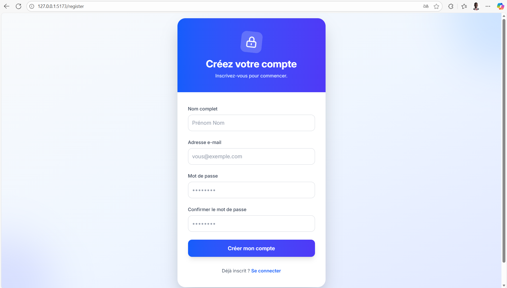
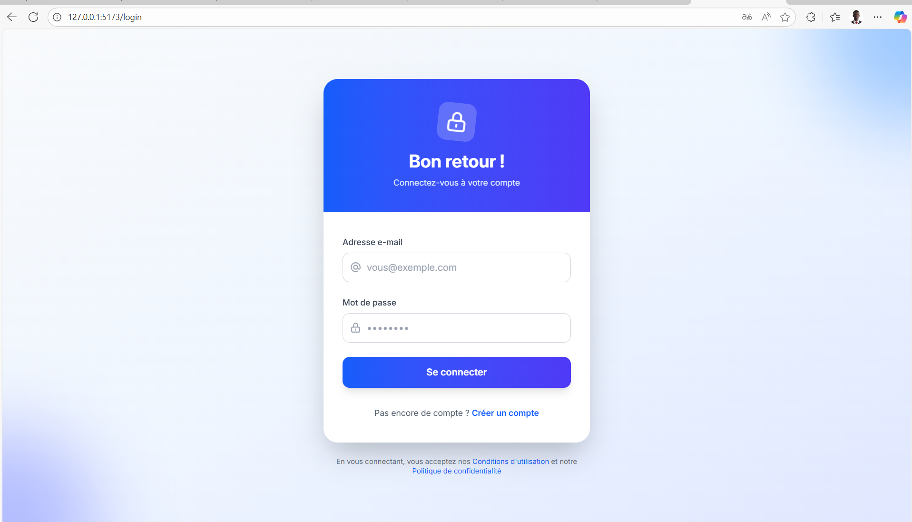
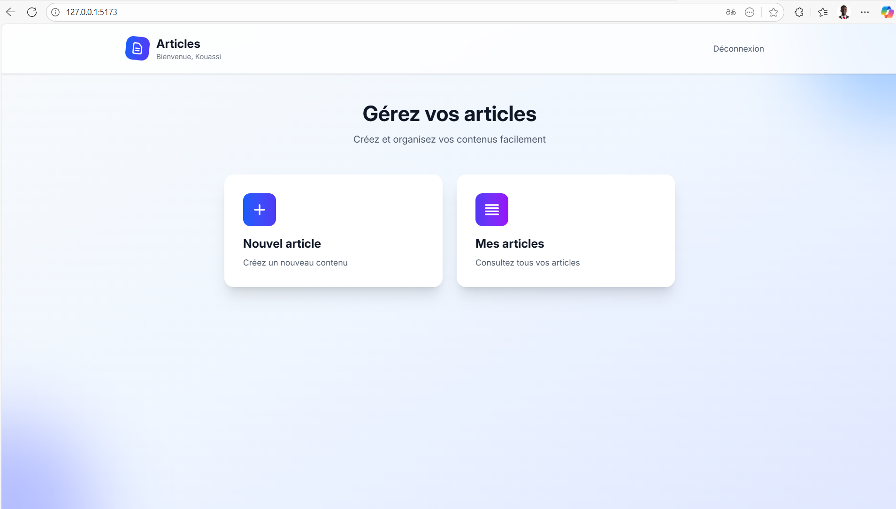
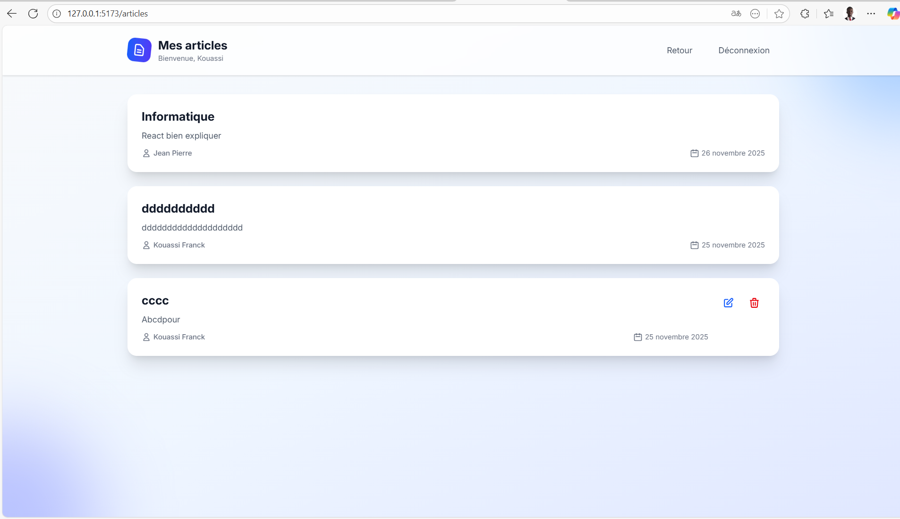
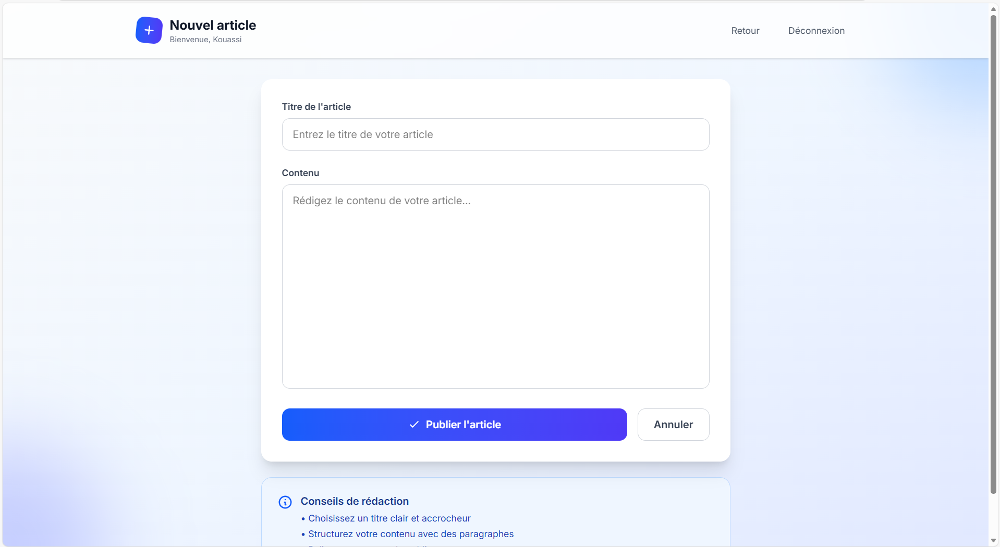

# Application Web Full-Stack - Test de Recrutement

## 📋 Description du Projet

Application web simple permettant la gestion d'articles avec authentification JWT. Stack moderne conteneurisée avec React, Node.js, PostgreSQL et Docker.

**Stack technique :** React 19 + React Router 7, Node.js 20 + Express 5, PostgreSQL 15, Prisma 7, Docker Compose

**Fonctionnalités :** Inscription/Connexion sécurisée (JWT + Bcrypt), CRUD complet des articles, interface moderne (Tailwind CSS), API RESTful

---

## 🏗️ Architecture du Projet

```
/Francky_test
├── back-end/
│   ├── prisma/
│   │   ├── migrations/          # Migrations Prisma
│   │   └── schema.prisma        # Schéma de la base de données
│   ├── src/
│   │   ├── controllers/         # Logique métier (à développer)
│   │   ├── middlewares/         # Middlewares Express
│   │   ├── routes/
│   │   │   ├── auth.js          # Routes d'authentification
│   │   │   ├── articles.js      # Routes CRUD articles
│   │   │   └── items.js         # Routes items (exemple)
│   │   ├── services/
│   │   │   └── prisma.js        # Configuration Prisma Client
│   │   ├── app.js               # Configuration Express
│   │   └── index.js             # Point d'entrée
│   ├── .env                     # Variables d'environnement backend
│   ├── Dockerfile               # Image Docker backend
│   ├── package.json
│   └── prisma.config.ts         # Configuration Prisma 7
│
├── front-end/
│   ├── app/
│   │   ├── lib/
│   │   │   └── api.ts           # Client API centralisé
│   │   ├── routes/
│   │   │   ├── home.tsx         # Dashboard protégé
│   │   │   ├── login.tsx        # Page de connexion
│   │   │   ├── register.tsx     # Page d'inscription
│   │   │   ├── articles.tsx     # Liste des articles
│   │   │   ├── articles.new.tsx # Création d'article
│   │   │   └── articles.$id.edit.tsx # Édition d'article
│   │   ├── welcome/
│   │   │   └── welcome.tsx      # Page d'accueil publique
│   │   ├── app.css              # Styles globaux
│   │   ├── root.tsx             # Racine React Router
│   │   └── routes.ts            # Configuration des routes
│   ├── public/                  # Fichiers statiques
│   ├── Dockerfile               # Image Docker frontend
│   ├── package.json
│   ├── vite.config.ts           # Configuration Vite
│   ├── tsconfig.json
│   └── react-router.config.ts
│
├── .env                         # Variables d'environnement globales
├── docker-compose.yml           # Orchestration des services
├── .gitignore
└── README.md
```

---

## 🚀 Installation et Lancement

**Prérequis :** Docker 20.10+, Docker Compose 2.0+, Git

**Commande unique :**
```bash
git clone <URL_DU_REPO>
cd Francky_test
docker-compose up --build
```

**Accès :**
- Frontend : http://localhost:5173
- Backend API : http://localhost:4000
- PostgreSQL : localhost:5432

**Arrêt :**
```bash
docker-compose down        # Arrêter
docker-compose down -v     # + supprimer les données
```

---

## 📡 Documentation API

**Base URL :** `http://localhost:4000`

**Authentification :** Header `Authorization: Bearer <jwt_token>` sur routes protégées

### Routes d'Authentification

| Méthode | Endpoint | Auth | Description |
|---------|----------|------|-------------|
| POST | `/auth/register` | Non | Créer un compte utilisateur |
| POST | `/auth/login` | Non | Se connecter et obtenir un token JWT |

#### POST /auth/register
**Body :**
```json
{
  "firstName": "Franck",
  "lastName": "Kouassi",
  "email": "franck@example.com",
  "password": "password123"
}
```
**Réponse (201) :**
```json
{
  "user": {
    "id": 1,
    "email": "franck@example.com",
    "firstName": "Franck",
    "lastName": "Kouassi",
    "createdAt": "2025-11-26T10:00:00.000Z"
  },
  "token": "eyJhbGciOiJIUzI1NiIsInR5cCI6IkpXVCJ9..."
}
```

#### POST /auth/login
**Body :**
```json
{
  "email": "franck@example.com",
  "password": "password123"
}
```
**Réponse (200) :**
```json
{
  "token": "eyJhbGciOiJIUzI1NiIsInR5cCI6IkpXVCJ9...",
  "user": {
    "id": 1,
    "email": "franck@example.com",
    "firstName": "Franck",
    "lastName": "Kouassi"
  }
}
```

### Routes des Articles

| Méthode | Endpoint | Auth | Description |
|---------|----------|------|-------------|
| GET | `/articles` | Oui | Liste tous les articles avec informations auteur |
| GET | `/articles/:id` | Oui | Détails d'un article spécifique |
| POST | `/articles` | Oui | Créer un nouvel article |
| PUT | `/articles/:id` | Oui | Modifier un article (propriétaire uniquement) |
| DELETE | `/articles/:id` | Oui | Supprimer un article (propriétaire uniquement) |

#### GET /articles
**Headers :** `Authorization: Bearer <token>`  
**Réponse (200) :**
```json
[
  {
    "id": 1,
    "title": "Mon premier article",
    "content": "Contenu de l'article...",
    "userId": 1,
    "createdAt": "2025-11-26T10:00:00.000Z",
    "user": {
      "id": 1,
      "firstName": "Franck",
      "lastName": "Kouassi",
      "email": "franck@example.com"
    }
  }
]
```

#### GET /articles/:id
**Headers :** `Authorization: Bearer <token>`  
**Réponse (200) :** Objet article avec informations auteur  
**Réponse (404) :** `{"message": "Article non trouvé"}`

#### POST /articles
**Headers :** `Authorization: Bearer <token>`  
**Body :**
```json
{
  "title": "Titre de l'article",
  "content": "Contenu de l'article..."
}
```
**Réponse (201) :**
```json
{
  "id": 2,
  "title": "Titre de l'article",
  "content": "Contenu de l'article...",
  "userId": 1,
  "createdAt": "2025-11-26T11:00:00.000Z"
}
```

#### PUT /articles/:id
**Headers :** `Authorization: Bearer <token>`  
**Body :**
```json
{
  "title": "Titre modifié",
  "content": "Contenu modifié..."
}
```
**Réponse (200) :** Article modifié  
**Réponse (403) :** `{"message": "Vous n'êtes pas autorisé à modifier cet article"}`  
**Réponse (404) :** `{"message": "Article non trouvé"}`

#### DELETE /articles/:id
**Headers :** `Authorization: Bearer <token>`  
**Réponse (200) :** `{"message": "Article supprimé avec succès"}`  
**Réponse (403) :** `{"message": "Vous n'êtes pas autorisé à supprimer cet article"}`  
**Réponse (404) :** `{"message": "Article non trouvé"}`

### Codes de Réponse HTTP

| Code | Description |
|------|-------------|
| 200 | Succès |
| 201 | Ressource créée |
| 400 | Requête invalide (champs manquants) |
| 401 | Non authentifié (token manquant/invalide) |
| 403 | Non autorisé (pas propriétaire) |
| 404 | Ressource non trouvée |
| 409 | Conflit (email déjà utilisé) |
| 500 | Erreur serveur |

### Exemples de Requêtes cURL

```bash
# Inscription
curl -X POST http://localhost:4000/auth/register \
  -H "Content-Type: application/json" \
  -d '{"firstName":"Franck","lastName":"Kouassi","email":"franck@test.com","password":"password123"}'

# Connexion
curl -X POST http://localhost:4000/auth/login \
  -H "Content-Type: application/json" \
  -d '{"email":"franck@test.com","password":"password123"}'

# Lister les articles
curl -X GET http://localhost:4000/articles \
  -H "Authorization: Bearer <votre_token>"

# Créer un article
curl -X POST http://localhost:4000/articles \
  -H "Content-Type: application/json" \
  -H "Authorization: Bearer <votre_token>" \
  -d '{"title":"Mon article","content":"Contenu de mon article..."}'

# Modifier un article
curl -X PUT http://localhost:4000/articles/1 \
  -H "Content-Type: application/json" \
  -H "Authorization: Bearer <votre_token>" \
  -d '{"title":"Titre modifié","content":"Contenu modifié..."}'

# Supprimer un article
curl -X DELETE http://localhost:4000/articles/1 \
  -H "Authorization: Bearer <votre_token>"
```

---

## 🗄️ Base de Données

**Tables Prisma :**

```prisma
model User {
  id        Int       @id @default(autoincrement())
  email     String    @unique
  password  String
  firstName String
  lastName  String
  createdAt DateTime  @default(now())
  articles  Article[]
}

model Article {
  id        Int      @id @default(autoincrement())
  title     String
  content   String?
  userId    Int
  user      User     @relation(fields: [userId], references: [id], onDelete: Cascade)
  createdAt DateTime @default(now())
}
```

---

## 🐳 Docker & Services

**3 services conteneurisés :**

| Service | Image/Build | Port | Description |
|---------|-------------|------|-------------|
| `elishama-db` | postgres:15-alpine | 5432 | Base PostgreSQL avec healthcheck |
| `backend` | ./back-end/Dockerfile | 4000 | API Node.js + Prisma (512MB RAM) |
| `frontend` | ./front-end/Dockerfile | 5173 | React + Vite avec HMR (1.5GB RAM) |

**Commandes utiles :**
```bash
docker-compose logs -f backend       # Voir les logs backend
docker-compose restart backend       # Redémarrer un service
docker-compose exec backend sh       # Accéder au shell backend
docker-compose exec elishama-db psql -U elishama_user -d elishama_db  # PostgreSQL CLI
```

---

## 📸 Captures d'écran

### Page d'Inscription


### Page de Connexion


### Dashboard


### Liste des Articles


### Ajout d'Article


---

## 🎯 Livrables du Test de Recrutement

✅ **Frontend React** - React Router 7 + Vite + Tailwind CSS + TypeScript  
✅ **Backend Node.js** - Express 5 + Prisma 7 + JWT + Bcrypt  
✅ **PostgreSQL** - Conteneur Docker avec migrations auto  
✅ **Pages obligatoires** - Inscription, Connexion, Liste articles (CRUD)  
✅ **API RESTful** - `/auth/register`, `/auth/login`, `/articles/*`  
✅ **Docker** - Dockerfiles + docker-compose.yml fonctionnels  
✅ **Démarrage unique** - `docker-compose up --build`  
✅ **README complet** - Architecture, installation, documentation API  
✅ **Code structuré** - Séparation front/back, routes organisées  
✅ **BDD opérationnelle** - Healthcheck + migrations automatiques

---

**Développé par** : KOUASSI KOUA KAN FRANCK ARMAND - Test de recrutement Ingénieur Développement
